  

 

## About

I'm Anupam. I build websites, Minecraft mods, and Android apps, and run a Discord community around it. AnupamBuilds started as a side thing and turned into most of what I spend my time on now.

I mostly work solo, end to end — design, build, deploy, and whatever comes after that.

 

## Stack

### Frontend

| Tool | |
|---|---|
| React | ██████████████████░░ 90% |
| Next.js | █████████████████░░░ 85% |
| Tailwind CSS | ██████████████████░░ 90% |
| TypeScript | ████████████████░░░░ 80% |
| Framer Motion | █████████████████░░░ 85% |
| Vite | █████████████████░░░ 85% |

### Backend

| Tool | |
|---|---|
| Node.js | ████████████████░░░░ 80% |
| Hono.js | ████████████████░░░░ 80% |
| Python | ██████████████░░░░░░ 70% |
| Java | ███████████████░░░░░ 75% |

### Data & Infra

| Tool | |
|---|---|
| Supabase | █████████████████░░░ 85% |
| Turso | ████████████████░░░░ 80% |
| PostgreSQL | ███████████████░░░░░ 75% |
| Prisma | ██████████████░░░░░░ 70% |
| Cloudflare Workers | — |
| Clerk / Razorpay | — |

### Minecraft

| Tool | |
|---|---|
| Fabric API | █████████████████░░░ 85% |
| Forge | ████████████████░░░░ 80% |
| Modrinth | ██████████████████░░ 90% |

 

## What I build

- **Web applications** — full-stack, mostly React/Next.js on the frontend, running lean on free-tier infra where it makes sense.
- **Minecraft mods & tools** — built with Fabric and Forge, published on Modrinth.
- **Discord bots** — custom automation for communities.
- **OSINT tooling** — recon and data-gathering tools, India-focused.

 

## Notes

> Most of what I ship starts as a personal itch — a tool I wanted, a mod my server needed, a dashboard that didn't exist yet. If it's useful to me, I usually put it out publicly too.
